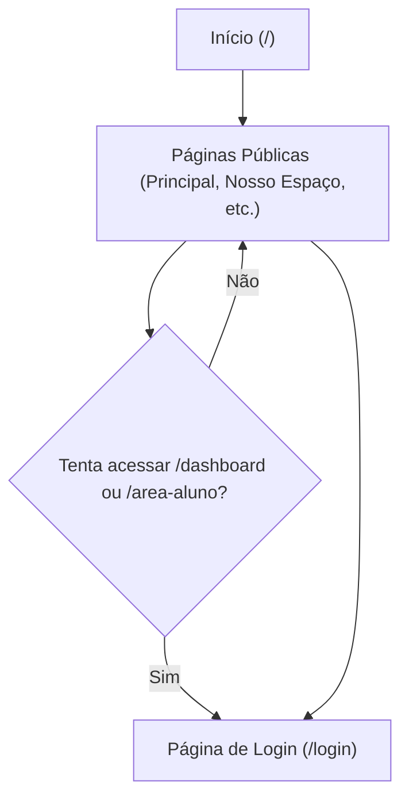
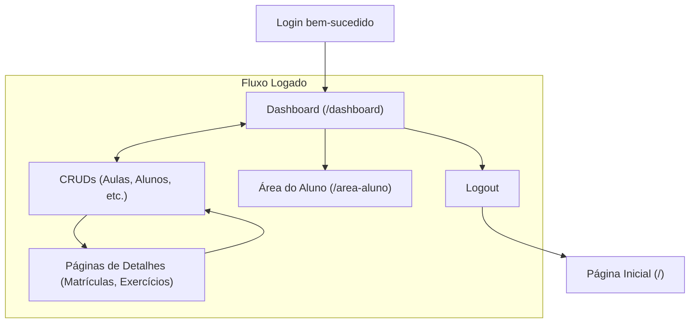
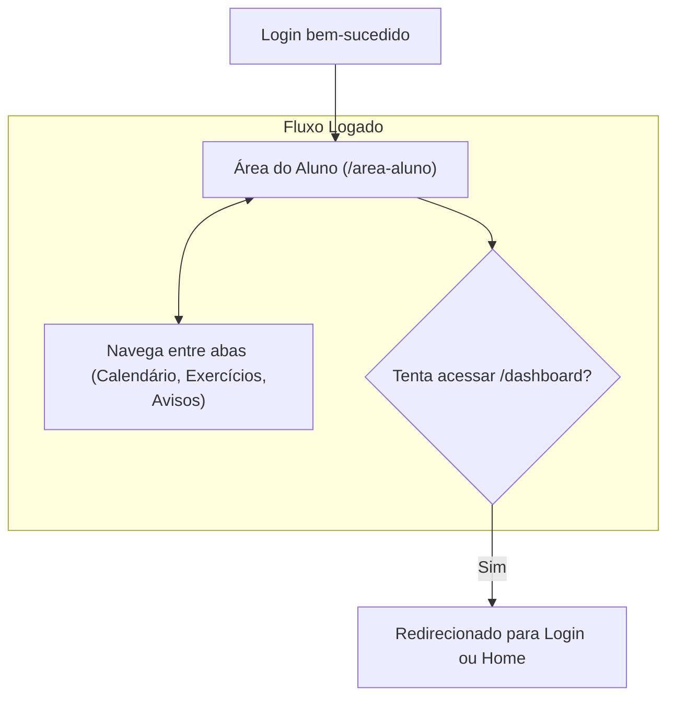
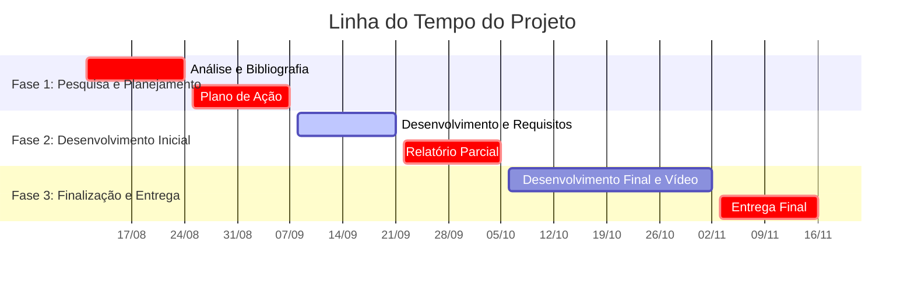

# Projeto Integrador II - Pilates PWA

<div align="center">
  
</div>

<div align="center">

# PROJETO INTEGRADOR EM COMPUTAÇÃO II
## Pilates PWA: Ferramenta para Gestão de Aulas


</div>

## 📋 Descrição do Projeto

Este projeto, no âmbito do "PJI240 - Projeto Integrador em Computação II", envolve todos os cursos do eixo de computação, com uma carga horária de 80 horas. O objetivo é desenvolver um software com framework web que utilize banco de dados, inclua script web (Javascript), nuvem, uso de API, acessibilidade, controle de versão e testes. Opcionalmente, pode incluir análises de dados. A ementa abrange resolução de problemas, levantamento de requisitos, desenvolvimento web com framework, HTML, CSS, linguagem de script, Banco de Dados, Controle de Versão, Nuvem, API, Acessibilidade, Testes e Análise de dados.

---

## 🗺️ Mapa do Projeto e Roteiro de Desenvolvimento

Esta seção detalha a estrutura completa do projeto, dividida em macrofases, para fornecer uma visão clara do progresso atual e dos próximos passos.

### **Macrofase 1: Fundação e Arquitetura** ✅ Concluída
- **Fase 1.1:** Configuração do Ambiente e Ferramentas
- **Fase 1.2:** Definição da Arquitetura e Estrutura

### **Macrofase 2: Funcionalidades Administrativas** ✅ Concluída
- **Fase 2.1:** Autenticação e Autorização
- **Fase 2.2:** Construção do Dashboard do Instrutor
- **Fase 2.3:** Gerenciamento de Conteúdo Dinâmico

### **Macrofase 3: Funcionalidades para o Usuário Final (Aluno)** ✅ Concluída
- **Fase 3.1:** Construção da Área do Aluno (Visualização)
- **Fase 3.2:** Ferramentas de Gestão para o Instrutor (Interação)

### **Macrofase 4: Refinamento e Qualidade** 🟡 Em Andamento
- **Fase 4.1:** Melhorias na Experiência do Usuário (UX)
  - ✅ Implementar sistema de notificações "Toast"
  - ✅ Implementar indicadores de carregamento visuais (Spinners)
  - ✅ Revisão de Usabilidade e Responsividade
- **Fase 4.2:** Otimização Técnica e PWA
  - 🟡 Refatorar código (mover estilos inline para CSS) (Em Andamento)
  - ⬜ Otimizar o comportamento offline do Service Worker

### **Macrofase 5: Preparação para Produção e Lançamento** ⬜ Pendente
- **Fase 5.1:** Configuração Final e Segurança
- **Fase 5.2:** Conteúdo e Testes Finais
- **Fase 5.3:** Lançamento e Pós-Lançamento

---

## 🌐 Fluxos de Navegação e Casos de Uso

Esta seção descreve os caminhos que cada tipo de usuário pode percorrer na aplicação.

### 👤 Usuário Visitante (Não Logado)

Simula a jornada de um novo cliente potencial explorando o site público.



### 👨‍🏫 Usuário Instrutor (Logado)

Testa todas as funcionalidades administrativas após o login.



### 🧘 Usuário Aluno (Logado)

Testa a experiência do cliente final dentro de sua área restrita.



---

## 📊 KANBAN DO PROJETO

[](https://)

Acesse o link acima para visualizar o quadro Kanban do projeto.

---

## ⏱️ Linha do Tempo Visual do Projeto



---

## 🔍 Cenário

*Detalhes do cenário do projeto a serem adicionados*

---

## ⚠️ Problema abordado

*Detalhes do problema a serem adicionados*

---

## 📝 PLANO DE AÇÃO

### Cronograma de Desenvolvimento

| Quinzena de referência | Etapas do relatório e demais elaboradas pelos alunos |
|------------------------|------------------------------------------------------|
| Quinzena Zero          | Análise do cenário da pesquisa.                      |
| Primeira quinzena      | Início do Levantamento Bibliográfico.                |
| Segunda quinzena       | Definição do Problema e Entrega do Plano de Ação.    |
| Terceira quinzena      | Definição do Título do trabalho e Desenvolvimento.   |
| Quarta quinzena        | Solução inicial e Entrega do Relatório Parcial.      |
| Quinta quinzena        | Solução final.                                       |
| Sexta quinzena         | Análise dos resultados e Início do vídeo.            |
| Sétima quinzena        | Revisão e entrega do Relatório Final, Vídeo e Avaliação colaborativa. |

---

## 📅 Cronograma de Atividades Detalhado

### Quinzena 1 (11/08/2025 - 24/08/2025)

**Objetivo:** Analisar o cenário do projeto e iniciar o levantamento bibliográfico para abordar o problema.

| Atividade | Responsável | Data de início | Data de finalização | Observação |
|-----------|-------------|----------------|---------------------|------------|
| | | | | |

### Quinzena 2 (25/08/2025 - 07/09/2025)

**Objetivo:** Interagir com a comunidade externa, definir o problema e organizar o plano de ação.

| Atividade | Responsável | Data de início | Data de finalização | Observação |
|-----------|-------------|----------------|---------------------|------------|
| | | | | |

### Quinzena 3 (08/09/2025 - 21/09/2025)

**Objetivo:** Definir título do trabalho, visitar o local de pesquisa, dar continuidade ao desenvolvimento do trabalho.

| Atividade | Responsável | Data de início | Data de finalização | Observação |
|-----------|-------------|----------------|---------------------|------------|
| | | | | |

### Quinzena 4 (22/09/2025 - 05/10/2025)

**Objetivo:** Construir e apresentar a solução inicial (Relatório Parcial); coletar sugestões com a comunidade externa; entregar o Relatório Parcial.

| Atividade | Responsável | Data de início | Data de finalização | Observação |
|-----------|-------------|----------------|---------------------|------------|
| | | | | |

---

## ✅ Requisitos Técnicos do Projeto

Esta seção serve como um controle para garantir que todos os requisitos técnicos do Projeto Integrador II sejam atendidos.

- [x] **Desenvolvimento com Framework Web:** O projeto utiliza **React** com **Vite**.
- [x] **Uso de Banco de Dados:** Implementado com **Supabase** (PostgreSQL).
- [x] **Inclusão de Script Web (JavaScript):** O projeto é construído sobre JavaScript, JSX e Node.js para as funções backend.
- [x] **Hospedagem em Nuvem:** O PWA e as Funções Serverless são implantados na **Netlify**.
- [x] **Uso de API:** O projeto cria sua própria API backend utilizando **Netlify Functions**.
- [ ] **Acessibilidade:** Garantir que a aplicação seja acessível a todos os usuários (padrões WCAG).
- [x] **Controle de Versão:** O código-fonte é gerenciado com **Git** e hospedado no **GitHub**.
- [ ] **Testes:** Implementar testes para garantir a qualidade e o funcionamento do software.
- [ ] **Análise de Dados (Opcional):** Incluir visualizações ou análises de dados coletados.

---

## 📚 Repositório Documental

[](https://alunounivespbr-my.sharepoint.com/:f:/r/personal/23216886_aluno_univesp_br/Documents/PROJETO%20INTEGRADOR%20)

Acesse o link acima para visualizar o repositório de documentos e artefatos.

---

## 👨‍💻 Participantes

<div align="center">

|  |  |  |
|:---:|:---:|:---:|
| [**LUCAS BRUNELLI MENDONCA**](https://github.com/luuchowl) | [**MATEUS FUJITA SILVEIRA**](https://github.com/mateusf) | [**ROBERTO JOAQUIM DOS SANTOS**](https://github.com/robertocsa) |

|  |  |  |
|:---:|:---:|:---:|
| [**RODRIGO JOSE DE MELO**](https://github.com/rodrigomelo) | [**LIVIA MARIA RONCOLETA**](https://github.com/liviamaria) | [**DANIEL MARTINS QUEIROZ**](https://github.com/danielmartins) |

|  |  |
|:---:|:---:|
| [**LEONARDO TOMAZ DE SOUZA NETO**](https://github.com/23216886alunounivesp) | [**WILLIAM YANG CHEN FAN**](https://github.com/williamyang) |

</div>

---

## 📅 Cronograma de Atividades e Entregas

### Tabela de Prazos

| Quinzena | Início     | Atividade | Vencimento das Atividades | Carência |
|----------|------------|-----------|---------------------------|----------|
| 1        | 11/08/2025 |           |                           |          |
| 2        | 25/08/2025 | Plano de Ação | 02/09/2025 às 23:59 | 07/09/2025 às 23:59 |
| 3        | 08/09/2025 |           |                           |          |
| 4        | 22/09/2025 | Relatório Parcial | 30/09/2025 às 23:59 | 05/10/2025 às 23:59 |
| 5        | 06/10/2025 |           |                           |          |
| 6        | 20/10/2025 |           |                           |          |
| 7        | 03/11/2025 | Relatório Final, Avaliação Colaborativa e Vídeo | 11/11/2025 às 23:59 | 16/11/2025 às 23:59 |

### Entregas (Sumário)

| Status | Entrega | Prazo | Notas |
|--------|---------|-------|-------|
| ⏳ | Plano de Ação | 02/09/2025 | Entregar o plano detalhado das ações. |
| ⏳ | Relatório Parcial | 30/09/2025 | Entregar relatório com progresso do projeto. |
| ⏳ | Relatório Final, Avaliação Colaborativa e Vídeo | 11/11/2025 | Entrega final do relatório e avaliação. |

---

## 🛠️ Tecnologias Utilizadas

Este projeto foi construído usando as seguintes tecnologias:

- **React:** Uma biblioteca JavaScript para construir interfaces de usuário.
- **Vite:** Um bundler de desenvolvimento rápido e eficiente para aplicativos web modernos.
- **Supabase:** Backend-as-a-Service (BaaS) com banco de dados PostgreSQL e Autenticação.
- **Netlify:** Plataforma para hospedagem (CDN) e execução de funções serverless (CI/CD).
- **`vite-plugin-pwa`:** Um plugin Vite para gerar automaticamente arquivos Service Worker e manifest para PWAs.
- **JavaScript:** A linguagem de programação principal do aplicativo.
- **CSS:** Para estilização e layout.
- **Git:** Para versionamento de código.
- **GitHub:** Para hospedagem do repositório e colaboração.
- **react-router-dom:** Para o gerenciamento das rotas de navegação

---

## ⚙️ Pré-requisitos e Instalação

Antes de começar, você precisará ter as seguintes ferramentas instaladas em seu sistema:

- **Node.js:** (versão LTS mais recente - 20.x) - [https://nodejs.org/](https://nodejs.org/)
- **npm:** (geralmente instalado com Node.js)
- **Git:** [https://git-scm.com/](https://git-scm.com/)

### Configuração do Ambiente

1. **Clone o Repositório:**
   ```bash
   git clone git@github.com:23216886alunounivesp/Projeto-Integrador-II.git
   ```

2. **Navegue até o Diretório do Projeto:**
   ```bash
   cd Pilates-PWA
   ```

3. **Instale as Dependências:**
   ```bash
   npm install
   ```

### Executando o Projeto

1. **Inicie o Servidor de Desenvolvimento:**
   ```bash
   npm run dev
   ```

2. **Para criar uma versão de produção:**
   ```bash
   npm run build
   ```

---

## 📄 Licença

Este projeto está sob a licença MIT.

---

<div align="center">
  <b>© 2025 UNIVESP - Projeto Integrador II</b>
</div>
