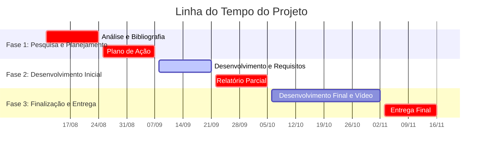

---

```markdown
# Projeto Integrador II - Pilates PWA


# <div align="center">PROJETO INTEGRADOR EM COMPUTAÇÃO II</div>
## <div align="center">Pilates PWA: Ferramenta para Gestão de Aulas</div>

<div align="center">


</div>

## 📋 Descrição do Projeto

Este projeto, no âmbito do "PJI240 - Projeto Integrador em Computação II", envolve todos os cursos do eixo de computação, com uma carga horária de 80 horas. O objetivo é desenvolver um software com framework web que utilize banco de dados, inclua script web (Javascript), nuvem, uso de API, acessibilidade, controle de versão e testes. Opcionalmente, pode incluir análises de dados. A ementa abrange resolução de problemas, levantamento de requisitos, desenvolvimento web com framework, HTML, CSS, linguagem de script, Banco de Dados, Controle de Versão, Nuvem, API, Acessibilidade, Testes e Análise de dados.

---

## 📊 KANBAN DO PROJETO

[](https://)

Acesse o link acima para visualizar o quadro Kanban do projeto, onde as atividades e tarefas estão organizadas para acompanhamento e gestão do progresso.

---
##   visually-hidden Linha do Tempo Visual do Projeto


```mermaid
gantt
    title Linha do Tempo do Projeto
    dateFormat  DD/MM/YYYY
    axisFormat %d/%m
    section Fase 1: Pesquisa e Planejamento
    Análise e Bibliografia :crit, 11/08/2025, 24/08/2025
    Plano de Ação         :crit, 25/08/2025, 07/09/2025
    section Fase 2: Desenvolvimento Inicial
    Desenvolvimento e Requisitos :active, 08/09/2025, 21/09/2025
    Relatório Parcial            :crit, 22/09/2025, 05/10/2025
    section Fase 3: Finalização e Entrega
    Desenvolvimento Final e Vídeo : 06/10/2025, 02/11/2025
    Entrega Final                 :crit, 03/11/2025, 16/11/2025
```

---

## 🗺️ Mapa do Projeto e Roteiro de Desenvolvimento

Esta seção detalha a estrutura completa do projeto, dividida em macrofases, para fornecer uma visão clara do progresso atual e dos próximos passos.

### **Macrofase 1: Fundação e Arquitetura** (Status: ✅ Concluída)
*   **Fase 1.1: Configuração do Ambiente e Ferramentas**
    *   Setup do ambiente de desenvolvimento (WSL2, Node, VS Code)
    *   Inicialização do projeto React com Vite e configuração do repositório no GitHub
    *   Criação e configuração dos serviços de nuvem (Supabase, Netlify)
*   **Fase 1.2: Definição da Arquitetura e Estrutura**
    *   Desenho do esquema do banco de dados (PostgreSQL)
    *   Implementação do sistema de rotas (React Router) e autenticação global (React Context)

### **Macrofase 2: Funcionalidades Administrativas** (Status: ✅ Concluída)
*   **Fase 2.1: Autenticação e Autorização**
    *   Implementação do fluxo de login com Supabase Auth (Google OAuth)
    *   Criação de rotas protegidas para diferenciar papéis (Instrutor vs. Aluno)
*   **Fase 2.2: Construção do Dashboard do Instrutor**
    *   Layout principal do dashboard com navegação
    *   Implementação dos CRUDs completos para Aulas, Alunos e Instrutores
*   **Fase 2.3: Gerenciamento de Conteúdo Dinâmico**
    *   CRUD para o conteúdo das páginas "Principal" e "Nosso Espaço"

### **Macrofase 3: Funcionalidades para o Usuário Final (Aluno)** (Status: 🟡 Em Andamento)
*   **Fase 3.1: Construção da Área do Aluno (Visualização)**
    *   ✅ Implementação do Calendário de Aulas do Aluno
    *   ✅ Implementação da lista de Exercícios do Aluno
    *   ✅ Implementação da seção de Avisos do Estúdio
*   **Fase 3.2: Ferramentas de Gestão para o Instrutor (Interação)**
    *   ✅ Implementação da Gestão de Matrículas (Aula -> Alunos)
    *   ✅ Implementação da Gestão de Avisos (CRUD de Avisos)
    *   🟡 **Implementação da Gestão de Exercícios por Aluno (Em Andamento)**

### **Macrofase 4: Refinamento e Qualidade** (Status: ⬜ Pendente)
*   **Fase 4.1: Melhorias na Experiência do Usuário (UX)**
    *   Implementar sistema de notificações "Toast"
    *   Implementar indicadores de carregamento visuais (Spinners)
*   **Fase 4.2: Otimização Técnica e PWA**
    *   Refatorar código (ex: mover estilos inline para CSS)
    *   Otimizar o comportamento offline do Service Worker

### **Macrofase 5: Preparação para Produção e Lançamento** (Status: ⬜ Pendente)
*   **Fase 5.1: Configuração Final e Segurança**
    *   Configurar domínio customizado
    *   Revisar e finalizar todas as Políticas de Segurança (RLS) no Supabase
*   **Fase 5.2: Conteúdo e Testes Finais**
    *   Cadastrar todo o conteúdo real do estúdio
    *   Realizar testes completos de ponta a ponta (E2E)
*   **Fase 5.3: Lançamento e Pós-Lançamento**
    *   Go-live do projeto
    *   Monitorar logs de erros e performance

---

## 🔍 Cenário

*Detalhes do cenário do projeto a serem adicionados*

---

## ⚠️ Problema abordado

*Detalhes do problema a serem adicionados*

---

## 📝 PLANO DE AÇÃO

### Cronograma de Desenvolvimento

| Quinzena de referência | Etapas do relatório e demais elaboradas pelos alunos |
|------------------------|------------------------------------------------------|
| Quinzena Zero          | Análise do cenário da pesquisa.                      |
| Primeira quinzena      | Início do Levantamento Bibliográfico.                |
| Segunda quinzena       | Definição do Problema e Entrega do Plano de Ação.    |
| Terceira quinzena      | Definição do Título do trabalho e Desenvolvimento.   |
| Quarta quinzena        | Solução inicial e Entrega do Relatório Parcial.      |
| Quinta quinzena        | Solução final.                                       |
| Sexta quinzena         | Análise dos resultados e Início do vídeo.            |
| Sétima quinzena        | Revisão e entrega do Relatório Final, Vídeo e Avaliação colaborativa. |

---

## 📅 Cronograma de Atividades Detalhado

### Quinzena 1 (11/08/2025 - 24/08/2025)
**Objetivo:** Analisar o cenário do projeto e iniciar o levantamento bibliográfico para abordar o problema.
| Atividade | Responsável | Data de início | Data de finalização | Observação |
|---|---|---|---|---|

### Quinzena 2 (25/08/2025 - 07/09/2025)
**Objetivo:** Interagir com a comunidade externa, definir o problema e organizar o plano de ação.
| Atividade | Responsável | Data de início | Data de finalização | Observação |
|---|---|---|---|---|

### Quinzena 3 (08/09/2025 - 21/09/2025)
**Objetivo:** Definir título do trabalho, visitar o local de pesquisa, dar continuidade ao desenvolvimento do trabalho.
| Atividade | Responsável | Data de início | Data de finalização | Observação |
|---|---|---|---|---|

### Quinzena 4 (22/09/2025 - 05/10/2025)
**Objetivo:** Construir e apresentar a solução inicial (Relatório Parcial); coletar sugestões com a comunidade externa; entregar o Relatório Parcial.
| Atividade | Responsável | Data de início | Data de finalização | Observação |
|---|---|---|---|---|

---

## ✅ Requisitos Técnicos do Projeto

Esta seção serve como um controle para garantir que todos os requisitos técnicos do Projeto Integrador II sejam atendidos.

- [x] **Desenvolvimento com Framework Web:** O projeto utiliza **React** com **Vite**.
- [x] **Uso de Banco de Dados:** Implementado com **Supabase** (PostgreSQL).
- [x] **Inclusão de Script Web (JavaScript):** O projeto é construído sobre JavaScript, JSX e Node.js para as funções backend.
- [x] **Hospedagem em Nuvem:** O PWA e as Funções Serverless são implantados na **Netlify**.
- [x] **Uso de API:** O projeto cria sua própria API backend utilizando **Netlify Functions** para se comunicar com o Supabase.
- [ ] **Acessibilidade:** Garantir que a aplicação seja acessível a todos os usuários (padrões WCAG).
- [x] **Controle de Versão:** O código-fonte é gerenciado com **Git** e hospedado no **GitHub**.
- [ ] **Testes:** Implementar testes para garantir a qualidade e o funcionamento do software.
- [ ] **Análise de Dados (Opcional):** Incluir visualizações ou análises de dados coletados.

---

## 📚 Repositório Documental

[](https://alunounivespbr-my.sharepoint.com/:f:/r/personal/23216886_aluno_univesp_br/Documents/PROJETO%20INTEGRADOR%20)

Acesse o link acima para visualizar o repositório de documentos e artefatos.

---

## 👨‍💻 Participantes

<div align="center">

|  |  |  |
|:---:|:---:|:---:|
| [**LUCAS BRUNELLI MENDONCA**](https://github.com/luuchowl) | [**MATEUS FUJITA SILVEIRA**](https://github.com/mateusf) | [**ROBERTO JOAQUIM DOS SANTOS**](https://github.com/robertocsa) |

|  |  |  |
|:---:|:---:|:---:|
| [**RODRIGO JOSE DE MELO**](https://github.com/rodrigomelo) | [**LIVIA MARIA RONCOLETA**](https://github.com/liviamaria) | [**DANIEL MARTINS QUEIROZ**](https://github.com/danielmartins) |

|  |  |
|:---:|:---:|
| [**LEONARDO TOMAZ DE SOUZA NETO**](https://github.com/23216886alunounivesp) | [**WILLIAM YANG CHEN FAN**](https://github.com/williamyang) |

</div>

---

## 📅 Cronograma de Atividades e Entregas

### Tabela de Prazos

| Quinzena | Início     | Atividade | Vencimento das Atividades | Carência |
|----------|------------|-----------|---------------------------|----------|
| 1        | 11/08/2025 |           |                           |          |
| 2        | 25/08/2025 | Plano de Ação | 02/09/2025 às 23:59 | 07/09/2025 às 23:59 |
| 3        | 08/09/2025 |           |                           |          |
| 4        | 22/09/2025 | Relatório Parcial | 30/09/2025 às 23:59 | 05/10/2025 às 23:59 |
| 5        | 06/10/2025 |           |                           |          |
| 6        | 20/10/2025 |           |                           |          |
| 7        | 03/11/2025 | Relatório Final, Avaliação Colaborativa e Vídeo | 11/11/2025 às 23:59 | 16/11/2025 às 23:59 |

### Entregas (Sumário)

| Status | Entrega | Prazo | Notas |
|--------|---------|-------|-------|
| ⏳ | Plano de Ação | 02/09/2025 | Entregar o plano detalhado das ações. |
| ⏳ | Relatório Parcial | 30/09/2025 | Entregar relatório com progresso do projeto. |
| ⏳ | Relatório Final, Avaliação Colaborativa e Vídeo | 11/11/2025 | Entrega final do relatório e avaliação. |

---

## 🛠️ Tecnologias Utilizadas

Este projeto foi construído usando as seguintes tecnologias:

*   **React:** Uma biblioteca JavaScript para construir interfaces de usuário.
*   **Vite:** Um bundler de desenvolvimento rápido e eficiente para aplicativos web modernos.
*   **Supabase:** Backend-as-a-Service (BaaS) com banco de dados PostgreSQL e Autenticação.
*   **Netlify:** Plataforma para hospedagem (CDN) e execução de funções serverless (CI/CD).
*   **`vite-plugin-pwa`:** Um plugin Vite para gerar automaticamente arquivos Service Worker e manifest para PWAs.
*   **JavaScript:** A linguagem de programação principal do aplicativo.
*   **CSS:** Para estilização e layout.
*   **Git:** Para versionamento de código.
*   **GitHub:** Para hospedagem do repositório e colaboração.
*   **react-router-dom:** Para o gerenciamento das rotas de navegação

---

## ⚙️ Pré-requisitos e Instalação

Antes de começar, você precisará ter as seguintes ferramentas instaladas em seu sistema:

*   **Node.js:** (versão LTS mais recente - 20.x) - [https://nodejs.org/](https://nodejs.org/)
*   **npm:** (geralmente instalado com Node.js)
*   **Git:** [https://git-scm.com/](https://git-scm.com/)

### Configuração do Ambiente

1.  **Clone o Repositório:**
    ```bash
    git clone git@github.com:23216886alunounivesp/Projeto-Integrador-II.git
    ```

2.  **Navegue até o Diretório do Projeto:**
    ```bash
    cd Pilates-PWA 
    ```

3.  **Instale as Dependências:**
    ```bash
    npm install
    ```

### Executando o Projeto

1.  **Inicie o Servidor de Desenvolvimento:**
    ```bash
    npm run dev
    ```

2.  **Para criar uma versão de produção:**
    ```bash
    npm run build
    ```

---

## 📄 Licença

Este projeto está sob a licença MIT.

---

<div align="center">
  <b>© 2025 UNIVESP - Projeto Integrador II</b>
</div>
```
